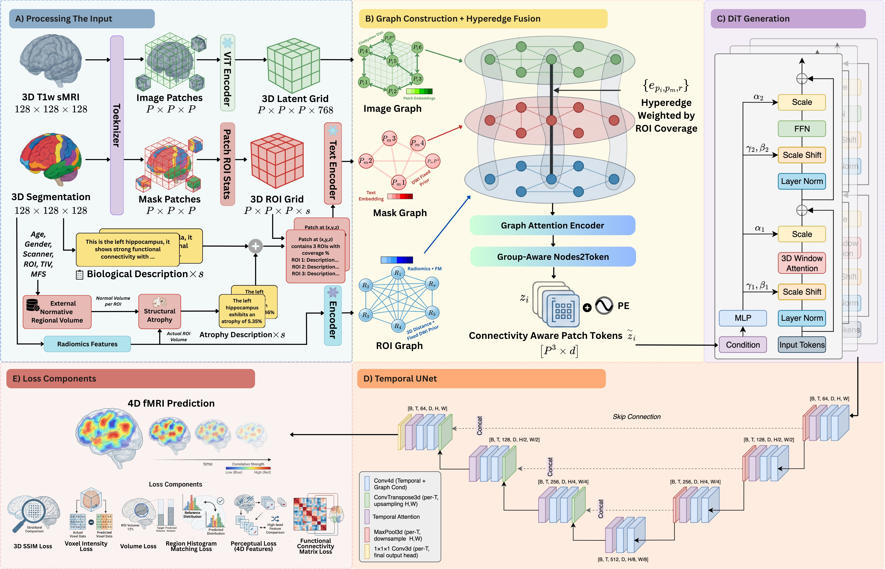

# CONNECT-4: Brain Connectivity-Guided Hyperedge Graph Fusion for Structural MRI to 4D Rest Functional MRI Synthesis



MICCAI 2026.

CONNECT-4 takes one anatomical scan and its segmentation and synthesises a full
4D resting-state fMRI sequence. It does so by building a **hypergraph** over
image patches, segmentation-mask patches and anatomical ROIs — fused with
diffusion-prior (DWI) connectivity and per-subject **normative atrophy** — and
decoding that representation with a **Diffusion Transformer (DiT)** followed by a
**Temporal UNet**. There is **no autoencoder / VAE** anywhere in the pipeline.

This repository is the clean, architecture-faithful implementation: every module
maps directly to a stage of the architecture above, and nothing that is not in
the paper is included.

---

## Architecture → code map

```
Processing the Input ────────────────────────────────────────────────────────
   3D T1w sMRI (128³) ─ tokenize ─ image patches ─ ViT Encoder (BrainIAC) ─┐
   3D Segmentation (128³) ─ tokenize ─ mask patches ─ Patch ROI Stats ──────┤  node
   Age/Gender/Scanner/ROI/TIV/MFS ─ Normative ─ Atrophy text ─ Text Encoder ─┘ features
                                                          (Clinical ModernBERT)

      models/brainiac_wrapper.py     frozen ViT image encoder      → image_nodes
      models/modernbert_wrapper.py   frozen Clinical-ModernBERT     → text/atrophy emb.
      normative/                     Potvin normative volumes + atrophy descriptions
      data/patchify.py               P×P×P tokenizer / ROI patch statistics

Graph Construction + Hyperedge Fusion ───────────────────────────────────────
      graphs/image_graph.py          Image Graph   (Chebyshev distance, k-NN)
      graphs/mask_graph.py           Mask Graph    (DWI fixed prior)
      graphs/roi_graph.py            ROI Graph     (radiomics + AnatCL FM, DWI prior)
      graphs/hypergraph.py           Hyperedges weighted by ROI coverage  e_{p_i,p_m,r}
      models/fusion.py               Graph Attention Encoder → Group-Aware
                                     Nodes2Token → connectivity-aware patch tokens z̃ [P³×d]

DiT Generation ──────────────────────────────────────────────────────────────
      models/dit4d.py                DiT block: LayerNorm→ScaleShift→3D-Window
                                     Attention→Scale→FFN with adaLN conditioning
      models/dit4d_temporal.py       per-frame generation indexed by temporal token

Temporal UNet ───────────────────────────────────────────────────────────────
      models/tc_film_unet.py         TCUNet4DFiLM: [B,T,64,D,H,W] → … → skip/Concat
                                     Conv4DBlock (temporal + Graph-Cond FiLM),
                                     Temporal Attention, MaxPool3d / ConvTranspose3d
                                     (per-T, H,W), 1×1×1 Conv3d output head

Loss Components ──────────────────────────────────────────────────────────────
      models/losses.py               3D SSIM · Voxel Intensity · Volume ·
                                     Region Histogram Matching · Perceptual (4D
                                     features) · Functional-Connectivity Matrix

Orchestrator / scripts ──────────────────────────────────────────────────────
      models/connect4.py             Connect4Model: wires the full pipeline
      training/train.py              training entry point
      inference/infer.py             synthesise 4D fMRI from sMRI (+ NIfTI/metrics/viz)
      eval/metrics.py                synthetic-vs-real metrics (incl. SLIM-Brain)
      eval/visualize.py              real-vs-synthetic magma figures
      configs/connect4.yaml          single, documented configuration
      scripts/train.slurm            4× A100 SLURM launcher
```

---

## Foundation models (frozen, as named in the paper)

| Role                       | Model               | Source / loading                                       |
|----------------------------|---------------------|--------------------------------------------------------|
| Image ViT encoder          | **BrainIAC**        | `BrainIAC/src/checkpoints/BrainIAC.ckpt` — https://github.com/AIM-KannLab/BrainIAC |
| Text encoder               | **Clinical ModernBERT** | `Simonlee711/Clinical_ModernBERT` (auto-downloads)  |
| ROI feature model          | **AnatCL**          | precomputed ROI embeddings (512-d) + radiomics (107-d) → `roi_nodes` (619-d) — https://github.com/EIDOSLAB/AnatCL |
| Perceptual / 4D-feature model | **BrainLM** / **SLIM-Brain** | `brainlm_mae/` (4D ViT-MAE) — https://github.com/vandijklab/BrainLM ; SLIM-Brain (voxel-level) — arXiv:2512.21881 |

All are **frozen**. BrainIAC and Clinical-ModernBERT are loaded inside their
wrappers. AnatCL ROI features are extracted offline and arrive in the batch as
`roi_nodes` (this is why `models.roi.embed_dim = 619`).

**4D perceptual features — SLIM-Brain.** The perceptual loss and the
synthetic-vs-real evaluation both use deep 4D features. We use **SLIM-Brain**
(Wang et al., 2025), a data- and training-efficient, atlas-free *voxel-level*
fMRI foundation model (lightweight temporal extractor + Hiera-JEPA encoder):

> Wang, M., Xia, J., Ye, W., Liu, E., Peng, K., Feng, J., Liu, Q., Wen, H.
> *SLIM-Brain: A Data- and Training-Efficient Foundation Model for fMRI Data
> Analysis.* arXiv:2512.21881 (2025).
> [arXiv](https://arxiv.org/abs/2512.21881) ·
> [OpenReview](https://openreview.net/forum?id=fFgzAQAUqs) ·
> [lab](https://github.com/ncclab-sustech)

`models/slimbrain_wrapper.py` (`SlimBrainEncoder`) loads the official weights
when available (`--slimbrain_weights` / `CONNECT4_SLIMBRAIN` env / config
`training.loss.slimbrain_weights`); otherwise it uses a deterministic, frozen 4D
encoder so the loss and metric remain well-defined and the code runs end-to-end.
Enable SLIM-Brain in the perceptual loss with `training.loss.perceptual_use_slimbrain: true`.

> **Setup note.** `BrainIAC/` (with `BrainIAC.ckpt`) and `brainlm_mae/` are large
> and are **not** bundled here. Place them at the repository root before training.
> Clinical-ModernBERT downloads automatically from HuggingFace. SLIM-Brain weights
> are optional (release pending).

---

## External normative regional volumes

Per-subject structural atrophy is computed from the **Potvin et al.** subcortical
normative model — the *original* `mmc2.xlsm` workbook, conditioned on
**age, sex, scanner manufacturer, field strength and TIV/ICV** (not cohort-level
statistics).

```python
from normative import AtrophyDescriber
describer = AtrophyDescriber("normative/mmc2.xlsm")
text = describer.describe_roi("Hippocampus L", measured_volume=3120.0,
                              age=68, sex=1, field_strength=0, manufacturer=3,
                              icv=1_480_000)
# "The Hippocampus L exhibits an atrophy of 5.35% relative to the
#  demographic-matched normative volume of 3296 mm^3 ..."
```

These sentences are encoded by Clinical-ModernBERT and injected as ROI-node text
features (the atrophy-description input).

* `normative/subcortical_norms.py` — workbook reader + prediction / 95% interval.
* `normative/atrophy.py` — atrophy fraction, z-score, and natural-language
  descriptions; `ASEG_TO_NORM_LABEL` maps segmentation labels to workbook ROIs.
* `normative/mmc2.xlsm` — the Potvin workbook (shipped).

---

## Loss

`models/losses.py` implements exactly the six loss terms and combines
them in `Connect4Loss` (weights in `configs/connect4.yaml → training.loss`):

| Term | Class | What it matches |
|------|-------|-----------------|
| 3D SSIM | `SSIM3DLoss` | structural similarity of the temporal-mean volume |
| Voxel Intensity | `VoxelIntensityLoss` | per-voxel L1 over the 4D volume (brain-masked) |
| Volume | `VolumeLoss` | integrated signal per ROI |
| Region Histogram Matching | `RegionHistogramLoss` | soft intensity histogram per ROI |
| Perceptual (4D) | `PerceptualLoss` | BrainLM deep features over ROI time-series |
| FC Matrix | `FCMatrixLoss` | ROI×ROI Pearson connectivity matrix |

All six are verified to run and back-propagate (finite gradients) on CPU.

---

## Installation

```bash
conda activate connect-4
pip install -r requirements.txt
```

`torch-geometric` is required by `models/fusion.py` (graph-attention +
hypergraph message passing); `openpyxl` by the normative reader; `nibabel` /
`nilearn` by preprocessing. External tools (SynthSeg, FSL, BrainIAC, BrainLM,
AnatCL, SLIM-Brain) are listed at the bottom of `requirements.txt`.

---

## Data & preprocessing

Per the paper, **both** modalities are conformed to a common grid —
**128 × 128 × 128 voxels, 3 mm isotropic** — and rs-fMRI has **128 frames at
TR = 3 s**.

Segmentation is produced with **SynthSeg**
(<https://github.com/BBillot/SynthSeg>), which **you run externally** (per its
repo). This pipeline does not call SynthSeg — it only consumes the label map you
provide (`--seg`) and conforms it to the grid.

```bash
# after running SynthSeg yourself, e.g. mri_synthseg --i T1w.nii.gz --o synthseg.nii.gz --robust
python -m preprocessing.preprocess_subject \
    --t1 sub-01_T1w.nii.gz --seg sub-01_synthseg.nii.gz \
    --fmri sub-01_bold.nii.gz --out_dir derivatives/sub-01
```

This produces `T1w_128.nii.gz`, `seg_128.nii.gz`, `bold_128.nii.gz`. Then run
`scripts/preprocess_graphs.py` and `scripts/precompute_hypergraphs.py` to extract
the frozen-FM node features and hypergraphs used by training. See
[`preprocessing/README.md`](preprocessing/README.md) for details.

---

## Training

```bash
python -m training.train --config configs/connect4.yaml
```

The dataset (`data/dataset_precomputed.py`) yields, per subject:
`image_nodes`, `mask_nodes`, `roi_nodes` (frozen-FM features), `patch_distributions`,
`dwi_matrix`, `structure_to_roi_idx`, `t1w`, `fmri` (target), `roi_masks`,
`brain_mask`. `Connect4Model.forward`:

1. builds the image / mask / ROI graphs and the coverage-weighted hypergraph,
2. fuses them into connectivity-aware patch tokens (`models/fusion.py`),
3. generates one fMRI frame per temporal index with the DiT, conditioned on the
   tokens and a low-res T1 embedding (adaLN),
4. refines + upsamples the stacked frames to the full 4D volume with the
   Temporal UNet,
5. scores the prediction with the six-term `Connect4Loss`.

Checkpoints are written to `configs → training.ckpt_dir` (`checkpoints/`).
On the cluster: `sbatch scripts/train.slurm` (4× A100).

---

## Inference

```bash
python -m inference.infer --config configs/connect4.yaml \
    --checkpoint checkpoints/connect4_epoch299.pt \
    --out_dir outputs --num 8 --visualize --metrics
```

For each subject this synthesises the 4D volume, saves it as `*_synthetic.nii.gz`,
optionally writes a magma real-vs-synthetic figure, and prints the metrics below.
(Runs with random weights too — useful for a quick functional check.)

## Evaluation metrics (`eval/metrics.py`)

`compute_all(pred, target, roi_masks, mask)` returns: `voxel_corr`, `ssim3d`,
`mse`, `mae`, `psnr`, `reho_corr`, `fc_corr`, `alff_corr`, `spectral_corr`, and
`slimbrain_dist` (cosine distance between SLIM-Brain 4D features).

## Visualisation (`eval/visualize.py`)

`plot_real_vs_synthetic(real, synthetic, out_path)` renders real vs synthetic
frames, temporal means and the difference map in the **magma** colormap;
`save_fmri_nifti` writes a 4D volume to NIfTI.

---

## Repository layout

```
requirements.txt             python dependencies (+ external tools)
configs/connect4.yaml        single documented configuration
preprocessing/               T1 + fMRI conforming (128^3 @ 3mm, 128 frames@TR3) + SynthSeg
data/                        dataset, precomputed-feature dataset, patchify, collate
graphs/                      image / mask / ROI graphs + hypergraph builder
models/
  brainiac_wrapper.py        frozen BrainIAC ViT image encoder
  modernbert_wrapper.py      frozen Clinical-ModernBERT text encoder
  fusion.py                  graph-attention + hyperedge + nodes2token
  dit4d.py                   base DiT block (3D window attention, adaLN)
  dit4d_temporal.py          temporal-frame DiT generation
  tc_film_unet.py            TCUNet4DFiLM — Temporal UNet decoder
  losses.py                  six loss components + Connect4Loss
  slimbrain_wrapper.py       frozen SLIM-Brain 4D feature extractor
  connect4.py                Connect4Model — full pipeline orchestrator
normative/                   Potvin normative volumes + atrophy descriptions
training/train.py            training entry point
inference/infer.py           sMRI → synthetic 4D fMRI (+ NIfTI / metrics / viz)
eval/                        synthetic-vs-real metrics + magma visualisation
scripts/                     preprocessing (graphs/hypergraphs) + train.slurm
utils/                       registration, scalers, visualisation
```
